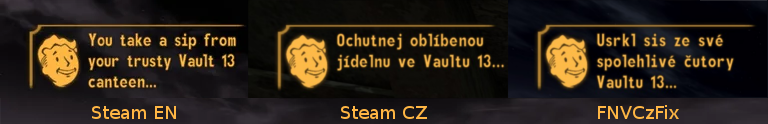

# FNVCzFix

Fallout New Vegas čeština – opravená/vylepšená verze

__O co jde?__

Hra Fallout: New Vegas vyšla s&nbsp;oficiální češtinou od Cenegy, která ale měla spoustu chyb. Cenega proto spojila síly s&nbsp;komunitou madbrahmin.cz, aby lokalizaci opravili. Tato verze vyšla jako oficiální patch a je tedy nainstalována společně se hrou, která se na Steamu jmenuje _Fallout: New Vegas PCR_ (dříve _Fallout: New Vegas RU_).

Bohužel ani tato verze češtiny není dokonalá a obsahuje chyby, které kazí zážitek ze hry. Komunitní patch dokonce přidává nějaké nové chyby u&nbsp;pasáží, které byly původně přeloženy dobře.

Cílem tohoto projektu je tedy opravit zbylé chyby v překladu, které se nachází ve Steam verzi _Fallout: New Vegas PCR_.

__Jaký je progress?__

Chyby v&nbsp;překladu objevuji během běžného hraní. Tzn., že musím mít čas a náladu na hraní FNV. Chyby jsou opravovány postupně. Během jednoho playthrough se hráč nesetká s&nbsp;veškerým dialogem, který hra nabízí, takže kompletní revize všech textů je v&nbsp;nedohlednu.

Momentálně bylo opraveno cca __24__ chyb.

__Stažení/instalace:__

Stačí stáhnout .esp a .esm soubory a nakopírovat je do `...\steamapps\common\Fallout New Vegas enplczru\Data`.

 

